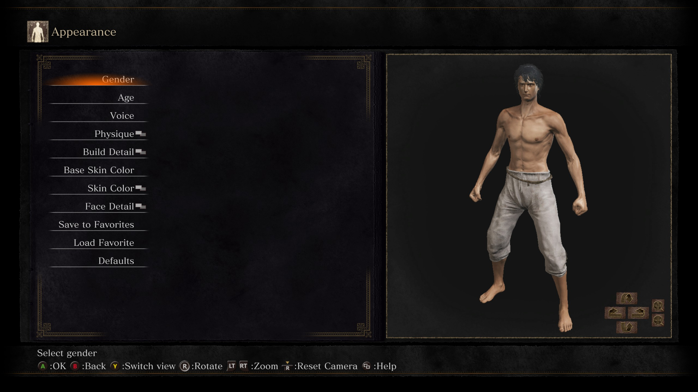

# Dark Souls 3 Auto Sliders
This program allows you to import or export Dark Souls 3 character creations. The character creations are stored as JSON files, which can also be created using this program. [Info for devs](MESSAGETODEVS.md)
# Installation 
To download the latest version, download the latest zip file from the [releases page](https://github.com/artizard/ds3AutoSliders/releases). To run it, first unzip the file, then run the "ds3AutoSliders.exe". Within the templateCharacters folder, I have provided some templates to try out. Additionally, be sure to not edit the assets or _internal folder, editing them will likely break the program. 
# How To Use
## Import From File To Game
1. With the "Open Json" button, choose your character file. If you don't have any, this program allows you to export from game to file, as well as it allows you to manually create them. 
2. Get your game ready by going to the first character creation page, which should have the options gender, age, voice, physique, build detail, etc. I attached an image for clarification 
3. Click the "Start:" button, then quickly go back to your game. You have 5 seconds to do this before the program will attempt to start importing. It can help to have Dark Souls 3 in windowed mode, as it'll let you tab back in quicker, but this shouldn't be necessary. Additionally, make sure you are actually focused in to the game, otherwise you may keep on getting a message that the game is not opened. 
4. Wait for the import to finish. Don't press any buttons or move your mouse while the import is going. If you need to stop it, it will automatically stop if you tab out, press buttons, move your mouse, etc. The speed of this will be dependent on your framerate, but at 60fps, it should take at most PLACEHOLDER minutes. 
## Export From Game To File
1. With the "Choose Save Location" button, choose a location and name for the file you are about to create. 
2. Get your game ready by going to the first character creation page, which should have the options gender, age, voice, physique, build detail, etc. I attached an image for clarification 
3. Click the "Start:" button, then quickly go back to your game. You have 5 seconds to do this before the program will attempt to start importing. It can help to have Dark Souls 3 in windowed mode, as it'll let you tab back in quicker, but this shouldn't be necessary. Additionally, make sure you are actually focused in to the game, otherwise you may keep on getting a message that the game is not opened. 
4. Wait for the export to finish. Don't press any buttons or move your mouse while the import is going. If you need to stop it, it will automatically stop if you tab out, press buttons, move your mouse, etc. The speed of this will be dependent on your framerate, but at 60fps, it should take at most PLACEHOLDER minutes. 
## Create File Manually
This feature allows you to manually make a character creation file using similar UI to the game. If you intend to copy a youtube tutorial, etc., this should be faster than manually going through the game, since this allows you to type in the numbers. 
1. Navigate through the menus and choose any settings you want to change. If you leave any settings blank, then the program will simply skip them when importing. This part largely mirrors the game's UI. 
2. Click the "Save" button and choose the name and location of the file that will be created. If it was saved successfully, you will get a popup saying so. 
3. Click "Reset To Menu" to go back, note that if you leave, you will lose your progress - so make sure you saved first. 
## Edit File
This is very similar to "Create File Manually", however it allows you to start with a pre-existing file, so you can edit it. 
1. When you go to this screen, the file dialog box will pop up, so choose the file you wish to edit. 
2. You can follow the instructions for "Create File Manually" from here.
# Disclaimers
I have designed this program to work on all systems regardless of fps or resolution, however I cannot guarantee that it will work at very low fps/resolution. 
# Troubleshooting tips
In case you run into any issues with the import/export, I've provided some troubleshooting steps. If none of these help, then feel free to message me (contact info is below), and I'll do my best to help. 
* Go to windowed mode
* Change in game brightness to 5
* Change resolution 
* If you are running at an unstable fps, then try closing other applications that might slow down the game. 
# Bug Reporting/Suggestions
If you notice any issues or have any suggestions, then feel free to contact me. I don't currently plan on adding any functionality to this program (just bug fixing), but regardless any feedback is appreciated. 
# Credits
fazedankinbank - This project was partially inspired by his [Elden Bling Auto Sliders](https://github.com/fazedankinbank/EldenBlingAutoSliders)\
Val, Miri-Chan, RedCronoJM, Michel² - I created some template files based on their creations, their videos are linked within "credits.txt" within the templateCharacters folder. 
# Contact info:
email : nicholascc76@gmail.com\
discord : ._.arti
